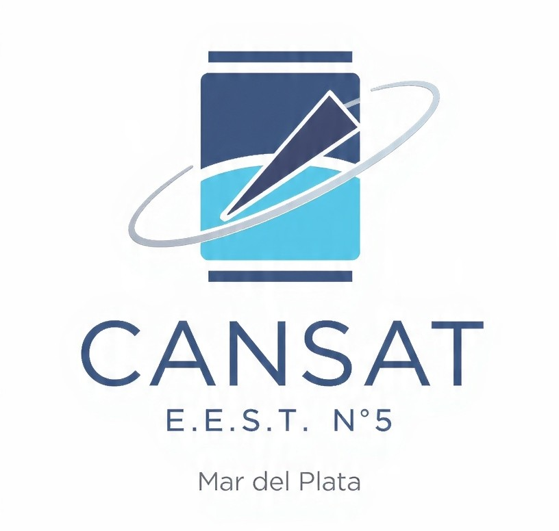
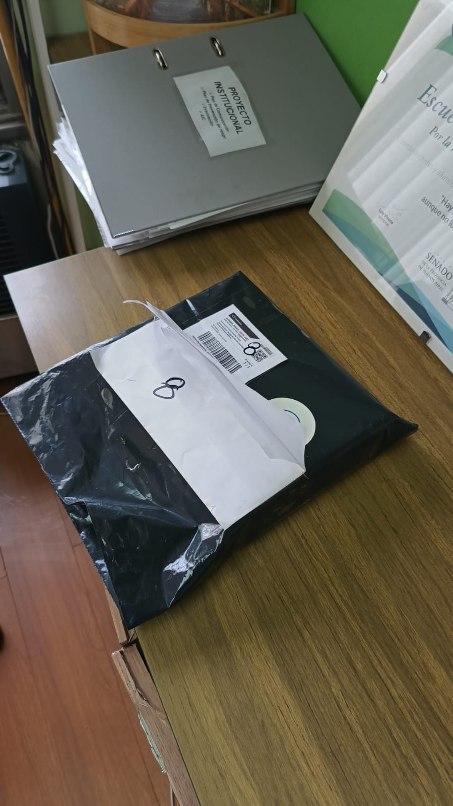

# CANSAT 2026 — E.E.S.T. N.º5 "Amancio Williams"

Repositorio destinado a documentar el proceso de participación de la **Escuela de Educación Secundaria Técnica N.º 5 "Amancio Williams" de Mar del Plata** en el **Certamen CANSAT Secundario 2026**, organizado por la **Comisión Nacional de Actividades Espaciales (CONAE)**.

Este repositorio tiene como objetivo conservar el registro del proceso realizado por los estudiantes y docentes de la Técnica N.º 5.

La documentación irá incorporando progresivamente:

- Diseño conceptual.
- Documento Preliminar de Diseño.
- Investigación y antecedentes.
- Diseño electrónico.
- Programación y firmware.
- Diseño mecánico.
- Sistema de descenso.
- Misión primaria.
- Misión secundaria.
- Pruebas y validaciones.
- Fotografías y videos.
- Informes de avance.
- Problemas encontrados y soluciones adoptadas.
- Presentaciones y material de difusión.

La intención es que el repositorio no sea solamente un lugar donde almacenar el resultado final, sino una **bitácora técnica y educativa del proceso de aprendizaje**.

Durante la convocatoria, nuestra institución estuvo representada por dos equipos:

| Equipo | Resultado |
|---|---|
| **A.N.T.I.R.** | Actualmente en la **Etapa 4 — Construcción, seguimiento y validación** |
| **PENTA Space** | Llegó a la **Etapa 3 — Selección de proyectos y recepción del kit** |

Ambos equipos realizaron un excelente trabajo a lo largo de la competencia, atravesando un proceso de aprendizaje que involucró ciencia, electrónica, programación, diseño, experimentación, documentación y trabajo en equipo.

## ¿Qué es CANSAT?

**CANSAT** es una iniciativa educativa vinculada al ámbito espacial que propone a estudiantes de escuela secundaria asumir el desafío de diseñar, construir, probar y operar un **satélite a escala**.

El nombre surge de la combinación de las palabras **CAN** (lata) y **SAT** (satélite), debido a que la carga útil debe estar contenida dentro de un volumen aproximadamente equivalente al de una lata de gaseosa.

En Argentina, la convocatoria es organizada por la **Comisión Nacional de Actividades Espaciales (CONAE)** y busca acercar la ciencia y la tecnología a estudiantes de todo el país. El desafío reproduce, a pequeña escala, distintas etapas de una misión espacial: desde la concepción y el diseño hasta la construcción, validación, lanzamiento y operación del sistema.

Además del desarrollo tecnológico, la propuesta busca fortalecer competencias relacionadas con las disciplinas **STEM —Ciencia, Tecnología, Ingeniería y Matemáticas—**, promover el pensamiento científico y favorecer el trabajo colaborativo.

## El desafío

Cada equipo debe desarrollar una **carga útil** de dimensiones reducidas, contenida dentro de un cilindro de aproximadamente el tamaño de una lata.

El CANSAT es transportado mediante un cohete hasta una determinada altura y posteriormente desciende mediante un sistema de descenso controlado, generalmente un paracaídas. Durante el descenso debe realizar mediciones y transmitir los datos correspondientes a la misión.

La **misión primaria** establecida para CANSAT 2026 consiste en realizar, durante el descenso, un **sondeo atmosférico de presión y temperatura**.

La convocatoria también contempla una **misión secundaria**, mediante la cual cada equipo puede incorporar una actividad adicional. Para esta edición se propuso como objetivo la obtención de una imagen o video durante el lanzamiento, apogeo y/o trayectoria de descenso.

El desafío no consiste únicamente en construir un dispositivo electrónico. Los estudiantes deben trabajar como un verdadero equipo de misión: investigar, diseñar, programar, construir, documentar, realizar pruebas, analizar resultados y comunicar sus decisiones técnicas.

## Etapas de la convocatoria

La competencia se estructura en **cinco etapas eliminatorias**. Cada instancia debe ser aprobada para poder avanzar a la siguiente.

### Etapa 1 — Capacitación

Los estudiantes y docentes participan de una capacitación virtual destinada a incorporar los conocimientos, herramientas y materiales necesarios para desarrollar el proyecto.

La capacitación combina contenidos asincrónicos con instancias sincrónicas y finaliza con una evaluación.

### Etapa 2 — Diseño y presentación del proyecto

Cada equipo debe elaborar y presentar su propuesta.

Entre los principales entregables se encuentran:

- **Documento Preliminar de Diseño (DPD)**.
- **Video de presentación del equipo**.
- Descripción de la misión primaria y secundaria.
- Organización y roles de los integrantes.

La evaluación considera tanto el proyecto técnico como la capacidad del equipo para comunicar sus ideas.

### Etapa 3 — Selección y kit de materiales

Los proyectos son evaluados por un jurado y se seleccionan aquellos que resultan factibles, originales y que evidencian el compromiso y la capacidad de los equipos.

Los proyectos seleccionados reciben un **kit de materiales** para continuar con la construcción del CANSAT.

**Llegada del kit de materiales de CONAE a nuestra escuela.**

### Etapa 4 — Construcción, seguimiento y validación

Los equipos seleccionados construyen el prototipo diseñado y deben presentar diferentes evidencias de avance, incluyendo documentación, fotografías, videos y otros materiales solicitados.

Al finalizar esta instancia se realiza una validación mediante una videollamada con especialistas, en la que se presenta el prototipo y se revisa su funcionamiento.

De esta instancia se seleccionan los **cinco equipos** que participan de la campaña de lanzamiento, además de las correspondientes menciones especiales.

### Etapa 5 — Campaña de lanzamiento

Los cinco equipos seleccionados participan de la campaña de lanzamiento de sus CANSAT y realizan las mediciones correspondientes.

La convocatoria establece que los equipos seleccionados reciben cobertura de transporte, alojamiento y pensión completa para estudiantes y docentes responsables. 

## Nuestra participación

La Técnica N.º 5 tuvo la posibilidad de presentar **dos equipos** en CANSAT 2026, alcanzando ambos un desempeño destacado.

La convocatoria permite la participación de hasta dos equipos por institución. Cada equipo debe estar integrado por entre tres y cinco estudiantes y contar con el acompañamiento de un docente responsable.

### Equipo A.N.T.I.R.

**A.N.T.I.R.** es uno de los equipos representantes de la Escuela de Educación Secundaria Técnica N.º 5 "Amancio Williams".

El equipo actualmente logró avanzar hasta la:

> **Etapa 4 — Construcción, seguimiento y validación de los CANSAT**

Esto implicó superar las etapas iniciales de capacitación, presentación del proyecto y selección de propuestas, para luego recibir el kit de materiales y avanzar en la construcción y validación del prototipo.

En esta etapa el trabajo pasó del diseño conceptual a la implementación concreta: integración de hardware, programación, construcción mecánica, pruebas, documentación y preparación de las evidencias solicitadas por CONAE.

## Equipo PENTA Space

**PENTA Space** fue el segundo equipo que representó a la Técnica N.º 5 "Amancio Williams" en CANSAT 2026.

El equipo logró avanzar hasta la:

> **Etapa 3 — Selección de proyectos y envío del kit de materiales**

Esto significa que su propuesta superó las instancias iniciales de capacitación y evaluación del proyecto, alcanzando la selección que habilitaba a los equipos a continuar con el desarrollo del prototipo.

Aunque el recorrido de PENTA Space finalizó en esta etapa, su participación constituyó un importante proceso de aprendizaje y desarrollo de competencias técnicas y de trabajo en equipo.

## Resultados de la convocatoria

La edición 2026 contó con **257 equipos inscriptos**, de los cuales **120 presentaron su propuesta** mediante el Documento Preliminar de Diseño.

La evaluación estuvo a cargo de un jurado integrado por profesionales de la **Universidad Tecnológica Nacional (UTN)**, la **CONAE** y la **Asociación de Cohetería Experimental y Modelista de Argentina (ACEMA)**.

Los equipos ubicados entre los puestos 1 y 20 fueron invitados a pasar a la siguiente etapa, mientras que los puestos 21 al 40 recibieron una mención de honor por su destacada participación.

La propia organización destacó la elevada calidad de los trabajos presentados y lo ajustado de los puntajes obtenidos. 

## Criterios de evaluación

A lo largo de la convocatoria, los proyectos son evaluados considerando diferentes aspectos:

- **Admisibilidad:** cumplimiento de los requisitos formales.
- **Presentación:** calidad y cumplimiento de las entregas, organización del equipo y comunicación del proyecto.
- **Creatividad:** originalidad del diseño y de la misión secundaria.
- **Viabilidad:** factibilidad de realización y planificación de las pruebas.
- **Relevancia:** claridad, pertinencia, grado de avance y complejidad de la propuesta.

Estos criterios hacen que CANSAT sea mucho más que una competencia de construcción de un dispositivo: el proceso completo de planificación, documentación, validación y comunicación forma parte del desafío. 

## Recursos

- [Capacitación y videos del proyecto](https://drive.google.com/drive/folders/1EPjXjjoXwsOttx_nsDYTwsNPLpWK6ylc?usp=sharing)

- [Comisión Nacional de Actividades Espaciales](https://www.argentina.gob.ar/ciencia/conae)

- [Asociación de Cohetería Experimental y Modelista Argentina](https://www.acema.com.ar/)

## Agradecimientos

A la **Comisión Nacional de Actividades Espaciales (CONAE)** por impulsar esta propuesta educativa y brindar a estudiantes de escuelas secundarias de todo el país la posibilidad de acercarse al desarrollo de tecnología espacial.

A **ACEMA** y a todos los profesionales que participaron de la capacitación, evaluación y acompañamiento de los equipos.

Y, especialmente, a los estudiantes de **A.N.T.I.R.** y **PENTA Space**, por el compromiso, la creatividad, el trabajo técnico y la dedicación demostrados durante todo el proceso.

Independientemente de la etapa alcanzada por cada equipo, ambos representaron a la **Escuela de Educación Secundaria Técnica N.º 5** y dejaron un valioso registro de aprendizaje, experimentación y trabajo colaborativo.